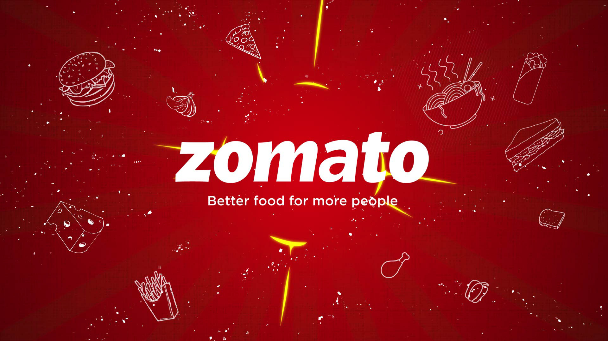

# Zomato Bangalore Market Analysis & BI Dashboard

  

## Project Overview
This project delivers an end-to-end data analytics solution processing over 51,000 restaurant records across the Bangalore region. By transitioning from exploratory data analysis (EDA) in Python to an interactive Business Intelligence layer in Power BI, this repository uncovers the key operational and financial drivers behind restaurant success, consumer engagement, and pricing strategies in India's tech capital.

---

## Data Engineering & Core KPIs
Raw web-scraped data was processed to evaluate operational baselines and isolate organizational trends:

* Total Region Engagement Volume: 15M Total Review Votes Recorded.
* Market Price Baseline: Average Cost for Two people sits at ₹555.60.
* Regional Quality Benchmark: The city-wide average rating baseline stands at 3.70/5.

---

## Business Questions Answered

### 1. Which neighborhood hubs dominate Bangalore in terms of quality vs. consumer volume?
* **Answer:** Koramangala (5th Block) reigns as the premier high-density dining hub, leading both in absolute customer volume (amassing massive review engagement loops via votes) and maintaining the highest overall average customer rating score. Nearby high-density corridors like Indiranagar and Jayanagar follow closely as elite tier-1 restaurant clusters.

### 2. Does a restaurant's digital integration directly correlate with customer satisfaction?
* **Answer:** Yes. Restaurants integrated into the Zomato online ordering infrastructure exhibit a tighter interquartile range (IQR) and a higher median rating profile. Platform onboarding acts as a strong operational stabilizer, drastically minimizing the incidence of severe low-rating outliers compared to traditional offline-only alternatives.

### 3. What is the explicit economic boundary between casual and premium dining segments?
* **Answer:** The availability of a table booking feature serves as the definitive statistical divider. Venues without table booking show a massive density peak concentrated tightly between ₹200 and ₹400 for two people. Conversely, integrating a table booking option shifts the entire density distribution curve out into a broad, premium pricing plateau ranging from ₹800 to ₹1,800+.

### 4. Does spending more money guarantee a superior dining experience for consumers?
* **Answer:** No. The statistical correlation matrix reveals that while customer engagement (votes) is moderately correlated with higher scores (0.43), the correlation between approx_cost and rate is weak (0.37). Bangalore’s food market values culinary execution and service quality far above a premium price tag.

---
## Tech Stack & Visual Assets
* **Data Processing & EDA:** Python (Pandas, NumPy, Seaborn, Matplotlib, Jupyter Notebooks)
* **BI Architecture:** Power BI Desktop (DAX Measures, Tile Filters, Grid Card UI Layout)
* **Dashboard Preview:**
  