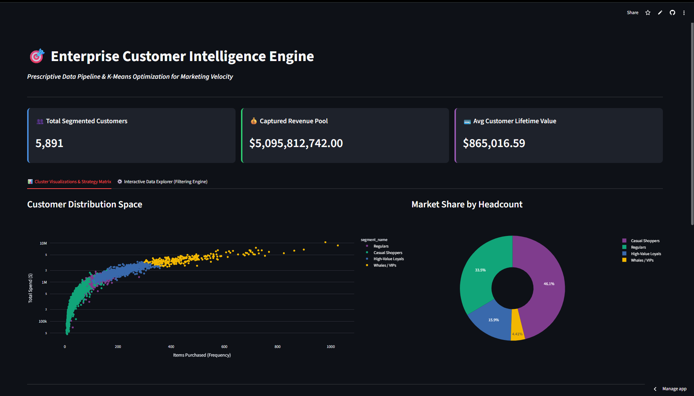
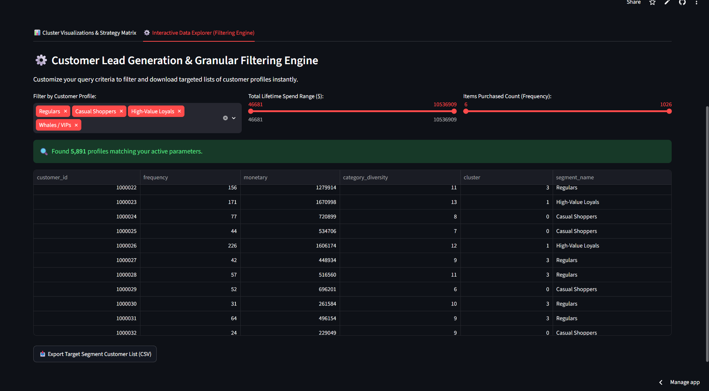

# 🎯 Enterprise Customer Intelligence Engine
> **Live Production URL:** [Click here to view the Application](https://dataanalyticsportfolio-6j2wrbykyotmshnqpd8ic4.streamlit.app/)

An end-to-end data pipeline and prescriptive analytics application that clusters **5,891 unique customer profiles** using unsupervised machine learning. This engine moves past basic static reporting to provide interactive data slicing and strategic marketing actions.

---

## 📊 Application Interface Preview

### Executive Performance KPI Panel


### Granular Customer Slicing & Filtering Engine


### Prescriptive Tactical Marketing Action Matrix


## 🏗️ Core Architecture & Pipeline Workflow


1. **ETL Pipeline:** Ingests raw transactional datasets, handles anomalies, and extracts Recency, Frequency, and Monetary (RFM) behavioral features.
2. **Feature Engineering:** Computes a unique `category_diversity` score measuring a user's exploration across store segments.
3. **K-Means Optimization:** Drops optimal cluster classifications across the distribution space.
4. **UI Presentation:** Deploys a live dashboard via Streamlit featuring metric cards, interactive segment calculators, and target lead-generation filtering engines with operational CSV downloading.

## 🛠️ Technology Stack
* **Language:** Python
* **Modeling:** Scikit-Learn (K-Means Clustering)
* **Dashboard/UI:** Streamlit, Custom HTML/CSS
* **Visualizations:** Plotly Express
* **Data Wrangling:** Pandas, NumPy

## ⚙️ How to Run Locally
1. Clone this repository.
2. Install dependencies: `pip install -r requirements.txt`
3. Run the application terminal command:
   ```bash
   streamlit run dashboard/app.py