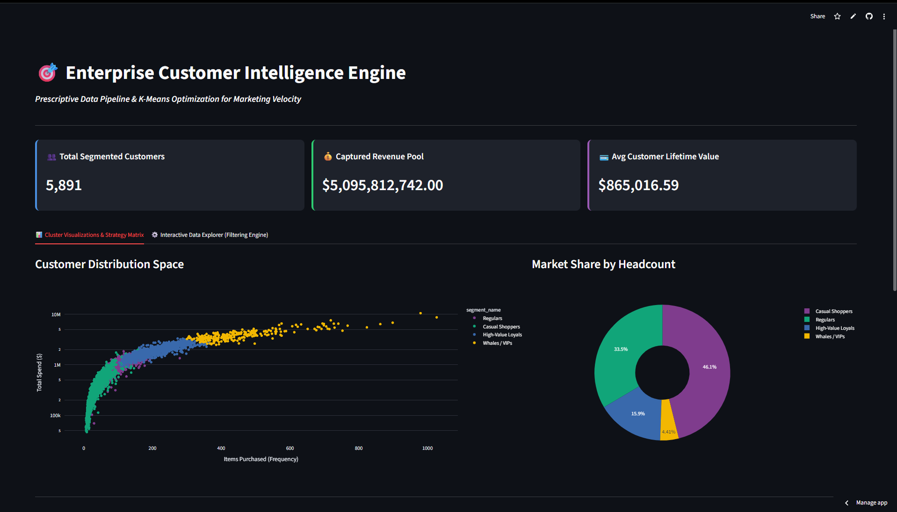
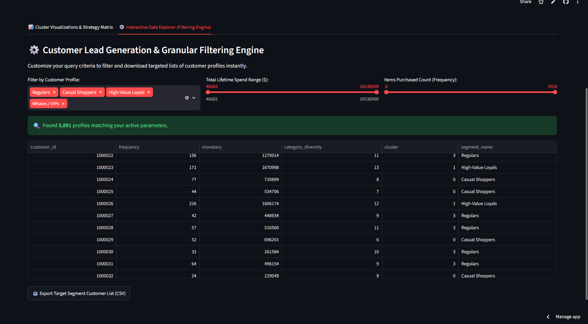
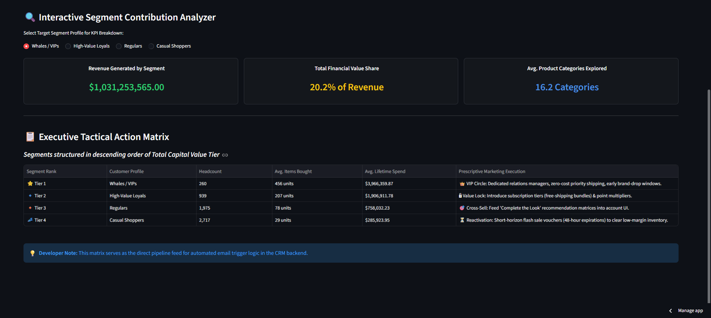

#  Enterprise Customer Intelligence Engine
> **Live Production URL:** [Click here to view the Application](https://dataanalyticsportfolio-6j2wrbykyotmshnqpd8ic4.streamlit.app/)

An end-to-end data pipeline and prescriptive analytics application that segments and clusters **5,891 unique customer profiles** using SQL data modeling and unsupervised machine learning. This engine moves past basic static reporting to provide interactive data slicing, lifecycle quantile tracking, and strategic marketing actions.

---

## Application Interface Preview

### Executive Performance KPI Panel


### Granular Customer Slicing & Filtering Engine


### Prescriptive Tactical Marketing Action Matrix


---

## Core Architecture & Pipeline Workflow

1. **SQL Analytics Engineering Layer:** Ingests raw transactional records via DuckDB (`sql/rfm_analytics.sql`), handles null values, aggregates purchase counts, and computes revenue percentiles using `NTILE(5)` and `DENSE_RANK()`.
2. **Feature Engineering & Preprocessing:** Computes cross-category exploration metrics and scales monetary/frequency distributions for clustering.
3. **K-Means Optimization:** Drops optimal cluster classifications across the distribution space to model behavioral segments.
4. **UI Presentation:** Deploys a live dashboard via Streamlit featuring metric cards, interactive segment calculators, and target lead-generation filtering engines with operational CSV downloading.

---

## SQL Analytics Engineering & Cohort Distribution

The raw transactional data is aggregated and segmented using an in-engine SQL pipeline powered by DuckDB.

### SQL Lifecycle Segment Breakdown

| Lifecycle Segment | Customer Count | Strategic Action |
| :--- | :--- | :--- |
| **Tier 1: High-Volume VIP** | 1,082 | Dedicated account managers & exclusive early access |
| **Tier 2: High-Value Whales** | 97 | Premium cross-sell & white-glove support |
| **Tier 3: Core Regulars** | 2,356 | Loyalty point acceleration & category expansion |
| **Tier 4: Occasional Buyers** | 1,178 | Re-engagement discounts & seasonal push alerts |
| **Tier 5: Low-Spend / Churn-Risk** | 1,178 | Automated win-back campaigns & price-drop triggers |

### Top Revenue Output Sample

| Customer ID | Gender | Age Group | City Tier | Orders | Total Spend | Avg Basket | Lifecycle Segment |
| :--- | :--- | :--- | :--- | :--- | :--- | :--- | :--- |
| `1004277` | M | 36-45 | A | 979 | $10,536,909 | $10,762.93 | **Tier 1: High-Volume VIP** |
| `1001680` | M | 26-35 | A | 1,026 | $8,699,596 | $8,479.14 | **Tier 1: High-Volume VIP** |
| `1002909` | M | 26-35 | A | 718 | $7,577,756 | $10,553.98 | **Tier 1: High-Volume VIP** |
| `1001941` | M | 36-45 | A | 898 | $6,817,493 | $7,591.86 | **Tier 1: High-Volume VIP** |

---

## Technology Stack
* **Database & Transformation:** SQL (ANSI / DuckDB CTEs & Window Functions)
* **Language:** Python
* **Modeling:** Scikit-Learn (K-Means Clustering)
* **Dashboard/UI:** Streamlit, Custom HTML/CSS
* **Visualizations:** Plotly Express
* **Data Wrangling:** Pandas, NumPy

---

## How to Run Locally
1. Clone this repository:
   ```bash
   git clone [https://github.com/your-username/Data_Analytics_Portfolio.git](https://github.com/your-username/Data_Analytics_Portfolio.git)